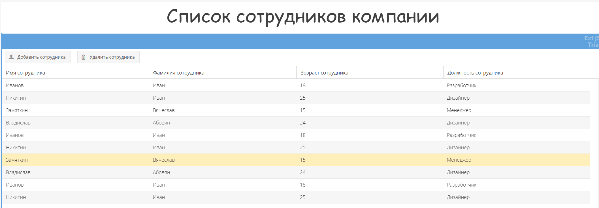
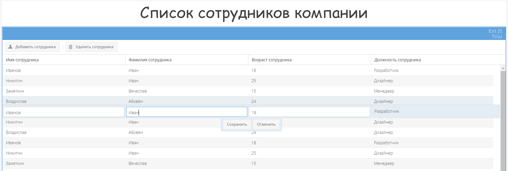
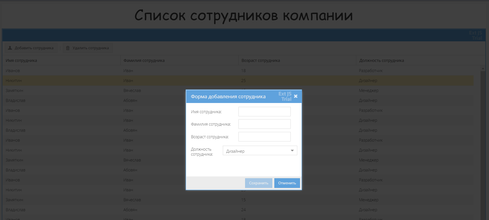

**Используемые технологии в проекте**

* Spring MVC 4 + MyBatis 3 + Ext Js 6 + Tomcat 9 + Apache Log4j + Lombok + Maven + DataBase PostgreSQL + REST API + CRUD

**Для запуска приложения на локальном компьютере**

Требуется :
* Установить Sencha CMD: http://cdn.sencha.com/cmd/6.7.0.63/jre/SenchaCmd-6.7.0.63-windows-64bit.zip

1. Склонируйте репозиторий
2. Настройки проекта Java 11, ```mvn package``` - загрузиться tomcat9,поднимиться BackEnd часть.    
3. Далее нужно открыть CMD перейти в каталог ```/src/main/webapp/PetShopClient``` - тут находиться FrontEnd часть.
4. Для запуска введите команду в cmd ```sencha app watch``` после загрузки сайт будет достапен по адресу http://localhost:1841
5. Скрипты для создания необходимых таблиц для работы приложения находятся в каталоге ```/src/main/resources/script``` 

Возможности:

* Получение всех сотрудников из базы данных.
* Удаление выбранного сотрудников в таблице.
* Создание нового сотрудников.
* Редактирование выбранного в таблице сотрудника (для редактирования, требуется дважды нажать левой кнопкой мыши на запись в таблице, после откроется меню редактирования)

Демонстрация: 

* Получение всех записей из базы данных



* Редактирование выбранного пользователя



* Создание нового пользователя


